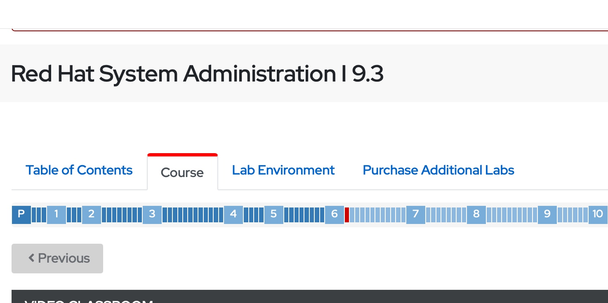
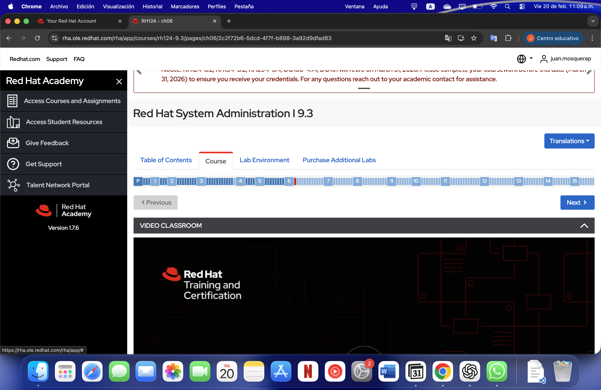

# Laboratorio 0 – Sistemas Operativos
## Reto 1: Entrando en confianza con la terminal

**Curso:** Sistemas Operativos  
**Entorno:** Ubuntu (Virtualizado en UTM sobre macOS)  
**Shell utilizada:** Bash 
**Integrantes:** Juan Esteban Mosquera Perea - 1046528349 | Maria Paula Mosquera Alvarez - 1022002020

---

# Objetivo

Familiarizarse con el uso de la terminal en Linux mediante la ejecución de comandos básicos para:

- Navegación entre directorios
- Creación y administración de archivos
- Uso de redirección de salida
- Eliminación y movimiento de archivos
- Comprensión de atajos (shortcuts)

---

# Desarrollo del laboratorio

---

##1️ Creación del directorio principal

Se creó la siguiente ruta:

```
~/operating-systems-20261/laboratories/lab0
```

### Comando utilizado:

```bash
mkdir -p ~/operating-systems-20261/laboratories/lab0
```

### Explicación:
- `mkdir` → crea directorios
- `-p` → crea toda la estructura si no existe

---

## 2️ Navegación entre directorios paso a paso

Se navegó de forma incremental usando:

```bash
cd operating-systems-20261
cd laboratories
cd lab0
```

Para verificar la ubicación actual:

```bash
pwd
```

Para visualizar contenido:

```bash
ls
ls -l
ls -la
```

### Comandos aprendidos:
- `pwd` → muestra la ruta absoluta
- `ls` → lista archivos
- `cd` → cambia de directorio
- `cd ..` → sube un nivel
- `cd ~` → va al directorio home
- `cd -` → regresa al directorio anterior

---

##  Guardar la ruta absoluta en un archivo

Se imprimió la ruta absoluta y se redirigió al archivo `path.txt`.

```bash
pwd > path.txt
```

### Explicación:
- `>` redirige la salida estándar a un archivo
- Si el archivo no existe, lo crea
- Si existe, lo sobrescribe

---

## Creación de múltiples directorios

Se crearon los siguientes directorios con un solo comando:

- example
- music
- photos
- projects

```bash
mkdir example music photos projects
```

---

##  Creación masiva de archivos

Se crearon 100 archivos en cada carpeta usando expansión de llaves:

```bash
touch example/file{1..100}
touch music/file{1..100}
touch photos/file{1..100}
touch projects/file{1..100}
```

### Concepto aprendido:
**Brace Expansion** permite generar múltiples nombres automáticamente.

---

##  Eliminación de archivos específicos

Se eliminaron:

- file1 a file10
- file81 a file100

Ejemplo:

```bash
rm example/file{1..10} example/file{81..100}
```

Se repitió el proceso para cada carpeta.

### Conceptos aprendidos:
- `rm` elimina archivos
- Eliminación por rangos
- Expansión de patrones

---

##  Movimiento de directorios

Se movieron los directorios `example`, `music` y `photos` dentro de `projects`:

```bash
mv example music photos projects/
```

### Concepto aprendido:
- `mv` permite mover archivos y directorios
- Si el destino es un directorio existente, mueve dentro de él

---

##  Eliminación con modo verboso y redirección

Se eliminaron los archivos (no directorios) dentro de `projects` utilizando modo verboso y redirigiendo la salida a un archivo:

```bash
rm -v projects/file* > output.txt
```

### Conceptos aprendidos:
- `-v` muestra qué archivos se están eliminando
- Redirección de salida estándar
- Uso de comodines (`*`)

---

# Atajos y herramientas utilizadas

| Comando | Función |
|---------|---------|
| pwd | Mostrar ruta actual |
| ls | Listar archivos |
| cd | Cambiar directorio |
| mkdir | Crear directorio |
| touch | Crear archivo vacío |
| rm | Eliminar archivo |
| mv | Mover archivos/directorios |
| nano | Editor de texto en terminal |

### Atajos en nano:
- `Ctrl + O` → Guardar
- `Ctrl + X` → Salir
- `Ctrl + K` → Cortar línea
- `Ctrl + U` → Pegar línea

---

# Módulos RedHat

Se completaron los módulos 1 al 5 de la plataforma RedHat como parte del proceso de familiarización con la terminal Linux.

# Evidencia - Módulos RedHat

## Maria Paula Mosquera


## Juan Esteban Mosquera


---

# Subida a GitHub

Desde la ruta:

```
~/operating-systems-20261
```

Se ejecutaron los siguientes comandos:

```bash
git init
git add .
git commit -m "Lab 0 completed"
git branch -M main
git remote add origin <URL_DEL_REPOSITORIO>
git push -u origin main
```

---

# Conclusión

Este laboratorio permitió comprender de manera práctica:

- La estructura jerárquica del sistema de archivos en Linux
- El uso eficiente de la shell
- Automatización mediante expansión de llaves
- Redirección de salida estándar
- Manipulación masiva de archivos

Se logró desarrollar mayor confianza en el uso de la terminal y comprensión de cómo el sistema operativo gestiona archivos y directorios.


